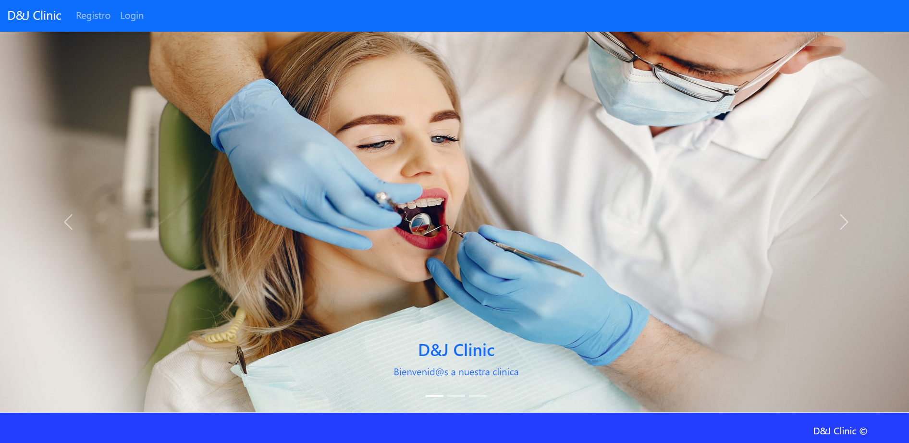
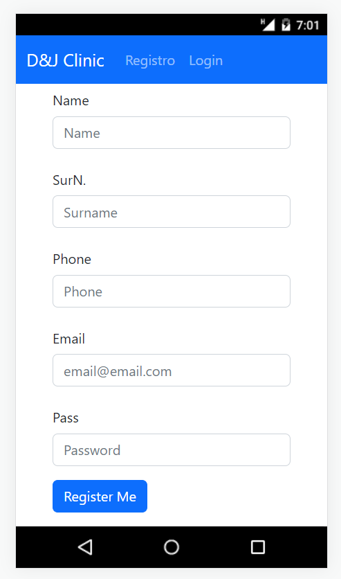
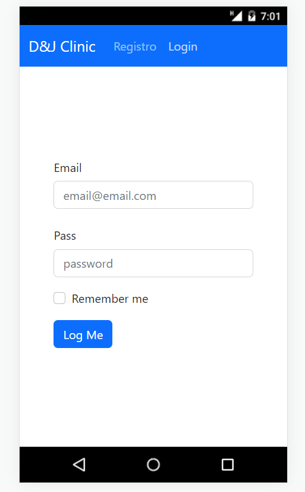
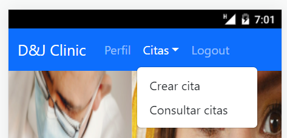
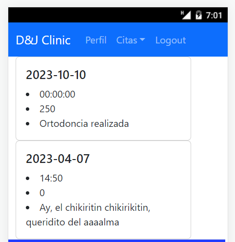
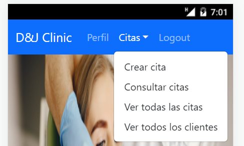
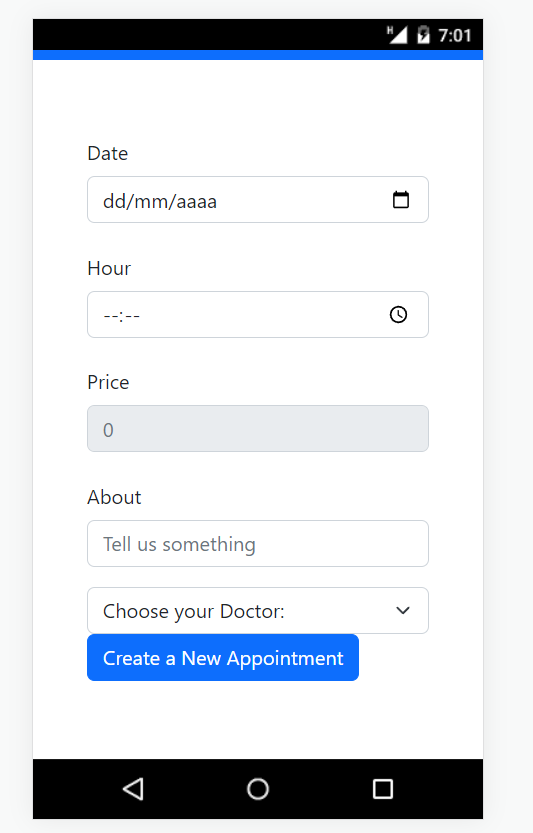

# D&J Clinic

  
Contenido 📝

  <ol>
    <li><a href="#sobre-el-proyecto">Sobre el proyecto</a></li>
    <li><a href="#stack">Stack</a></li>
    <li><a href="#capturas">Capturas</a></li>
    <li><a href="#agradecimientos">Agradecimientos</a></li>
  </ol>

## Sobre el proyecto
---

Este es el proyecto número 5 del bootcamp fullstack developer de  GeeksHubs Academy en Valencia, realizado por David. En este proyecto hemos realizado la parte frontend a raiz del backend ya hecho en el proyecto 4.

Como clientes podremos: 
<ol>
<li>Crear una cita</li>
<li>Revisar nuestras propias citas</li>
<li>Revisar nuestro perfil</li>
</ol>

Como Admin podremos:
<ol>
<li>Realizar todo lo anterior mencionado</li>
<li>Comprobar todos los clientes existentes</li>
<li>Comprobar todas las citas existentes</li>
</ol>

---

## Stack
Tecnologías utilizadas:

</a>

 

 
 ---

## Capturas del proyecto

Capturas

En primer lugar teneis una vista donde se puede apreciar un navbar por el cual de primeras solo podremos o bien registrarnos o hacer login. 

Aquí teneis una captura del formulario de registro:

Este sería el formulario de login:

Una vez registrados pasaremos a ser automaticamente clientes, por lo cual podemos apreciar que del navbar desaparecen las opciones "Registro" y "Login" y en su lugar tendremos las opciones de ver nuestro perfil, crear una cita, ver nuestras y realizar el logout.

Aquí teneis un ejemplo de la página para ver nuestras citas ya programadas:

Si iniciamos sesión como administrador tendremos un par de funcionalidades añadidas, las cuales son: Ver todos los clientes existentes en la base de datos y ver todas las citas existentes en la base de datos.

Aqui teneis el formulario para crear una nueva cita:

--- 

## Agradecimientos

Me gustaría agradecer como siempre a todos los docentes y a nuestros compañeros que dia a dia me brindan su apoyo y hacen que todo esto sea posible. Muchas gracias.

